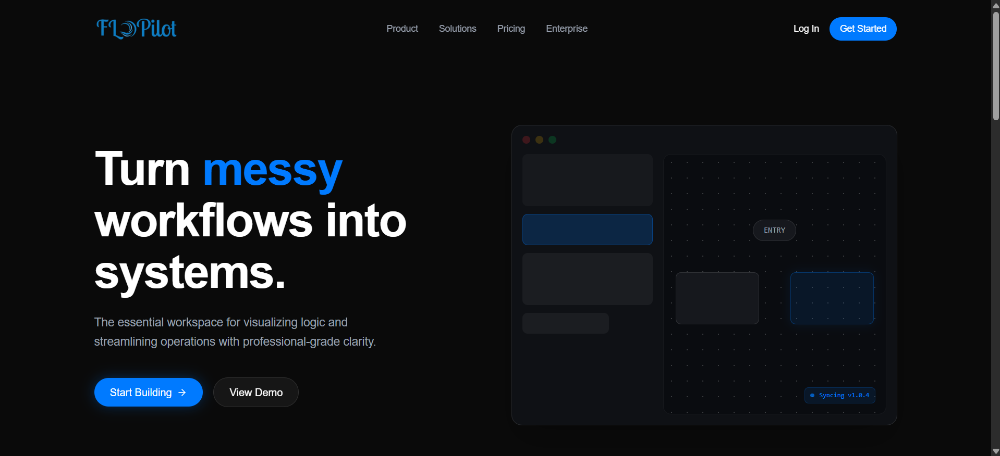
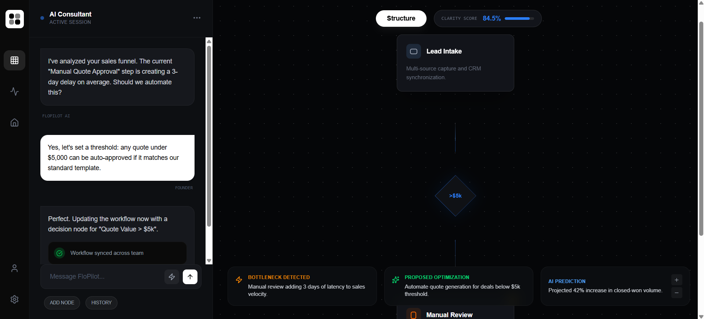

## 🤖 FloPilot

**FloPilot** is a **frontend-only prototype** built for the **Snow Frost Hackathon** held at **Jamia Hamdard University, South Delhi**, where our team qualified up to the **Semi-Finals**.  
The project demonstrates how early-stage startups and SMBs can explain their workflows in plain English and instantly visualize them as structured, professional-grade process flows—helping teams move from operational chaos to clarity without requiring process expertise or any backend automation.

---

## 🛠️ Tech Stack (Frontend Only)

- **React (JavaScript)** – Core framework for building the interactive UI  
- **React Flow** – Real-time workflow and process flow visualization  
- **Tailwind CSS** – Clean, responsive, and professional UI styling  
- **Vite** – Fast development server and build tooling  

> ⚠️ This repository contains **only the frontend prototype**.  
> There is **no backend, database, or AI model integration** included in this repo.

---

## ✨ Key Features (Prototype Scope)

- Conversational-style interface to describe workflows in plain English  
- Real-time visual generation of clean, easy-to-read process flowcharts  
- Clear representation of steps, decisions, and ownership within a workflow  
- Side-by-side visualization to demonstrate process structure and clarity  
- UI designed for non-technical users and early-stage startup teams  

> 🚧 Features are **demonstrative only** and represent the intended product experience without live AI processing.

---

## 🏆 Hackathon Context & Achievement

This project was developed as part of the **Snow Frost Hackathon** hosted at **Jamia Hamdard University, South Delhi**.  
Our team, **404 No Sleep**, successfully qualified up to the **Semi-Finals**, where FloPilot was evaluated for its innovation in AI-driven business operations and productivity.

The prototype was built to clearly demonstrate the core idea, user experience, and problem-solving approach within a limited hackathon timeframe.

---

## Screenshots

### Landing Page

### Dashboard

---

## ⚠️ Limitations & Future Scope

### Current Limitations
- Frontend-only prototype with no backend or AI integration  
- Workflow generation and analysis are UI demonstrations, not data-driven  
- No user authentication, persistence, or export functionality  

### Future Scope
- Integrate AI-powered workflow analysis and optimization  
- Add backend services for workflow storage and versioning  
- Introduce guided conversational process discovery  
- Expand to team collaboration and process maturity insights  

This prototype focuses on showcasing the **core concept, UX, and value proposition** of FloPilot.
